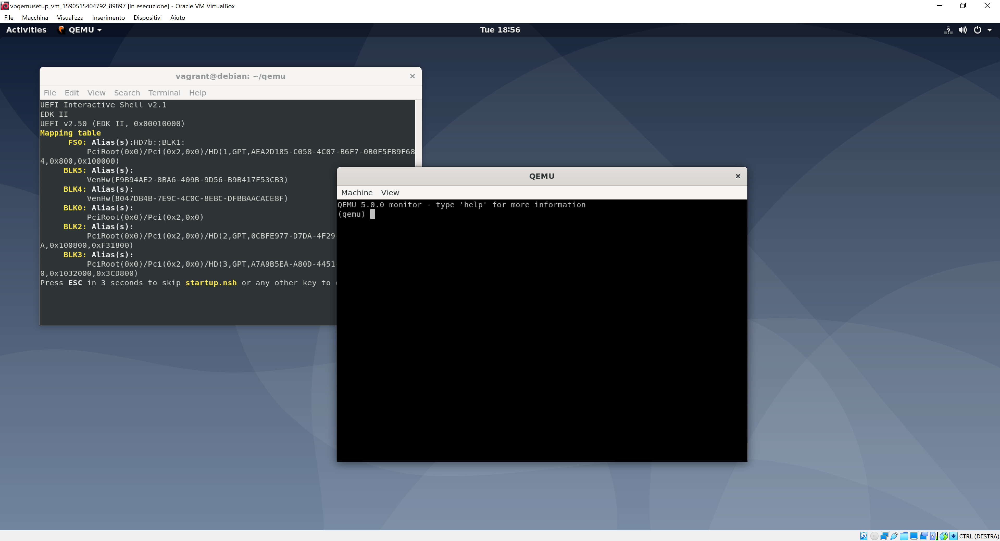
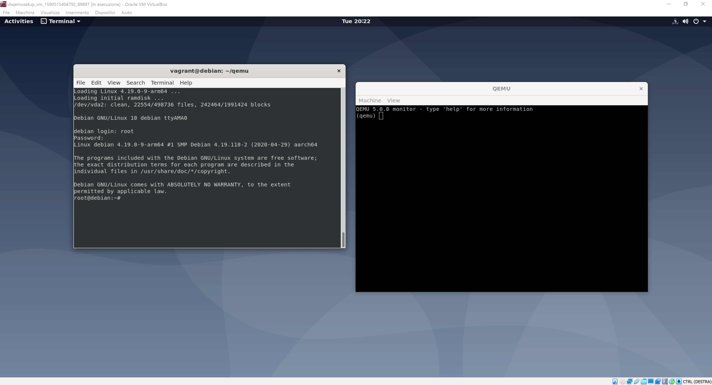

# Lampone Pi

Live, readonly Debian arm64 port for the Raspberry Pi 3.

## qemu box

**Install the qemu box**

This procedure automates the installation of a VirtualBox environment (Debian Buster x86_64) in which a qemu installation of Debian Buster arm64 is present. The "qemu box" will be used to *build a live image of Debian Buster for arm64* and then write the image to a SD card in a way it is compatible with a Raspberry Pi.
The qemu box is not required if you can manage to set up a qemu installation and run the *lampone-install.sh* within a Linux box (see later on).

*Requirements* (you need to install the following prerequisites in your operating system before running the "qemu box" installation):
 - VirtualBox (with guest additions) 
 - Vagrant
 - from a terminal: *vagrant plugin install vagrant-reload*

*Run the installation:*

 - clone or download this GitHub repository 
 - *cd /path/to/lampone-pi*
 - *cd vbqemu.setup* 
 - *vagrant up*

*At the end of the setup, a VirtualBox machine is created:*
 - ssh host to guest: *ssh root@127.0.0.1 -p 2222* (password is: *password*)
 - VirtualBox user: *vagrant* | *vagrant*

You can use the VirtualBox GUI as you are used to, from now on.

**\
\
Use the qemu box: launch the Debian arm64 system on qemu**

Within VirtualBox, open a terminal and launch the qemu emulation (as vagrant user):

    cd qemu/
    ./run.sh 
 
A bind from port 22 of the qemu system and port 10022 of the vbox system is created, in order to be able to perform ssh and scp, see later.

For booting the Debian arm64 system, on the qemu efi terminal give:

    FS0:
    cd EFI/debian
    grubaa64.efi

Log in as root (password: *password*) and you are ready to live-build.

**\
\
Prepare the qemu system for the live building (setup once)**

A patched live-build is needed for a correct live-building. The .deb package of live-build patched by our Team has been already copied onto the vbox system, so now we have to copy and install it onto the qemu system.

On the qemu system we "start the network" and modify the sshd config for root user to be able to accept direct connections:

    dhclient
    sed -i 's/^#PermitRootLogin.*/PermitRootLogin yes/g' /etc/ssh/sshd_config; systemctl restart ssh
    
Now on the vbox system:

     scp -P 10022 /home/vagrant/live-build2019031131_all.deb root@127.0.0.1:/tmp

Finally, on the qemu host:

    dpkg -i /tmp/live-build2019031131_all.deb; apt install -fy

**\
\
Live build: create a ISO for a generic live Debian arm64 system**

Live building a minimal OS is now trivial:

    mkdir live
    cd live/
    
    dhclient

    lb config --distribution buster --debian-installer-distribution daily --bootloaders syslinux
    lb build
